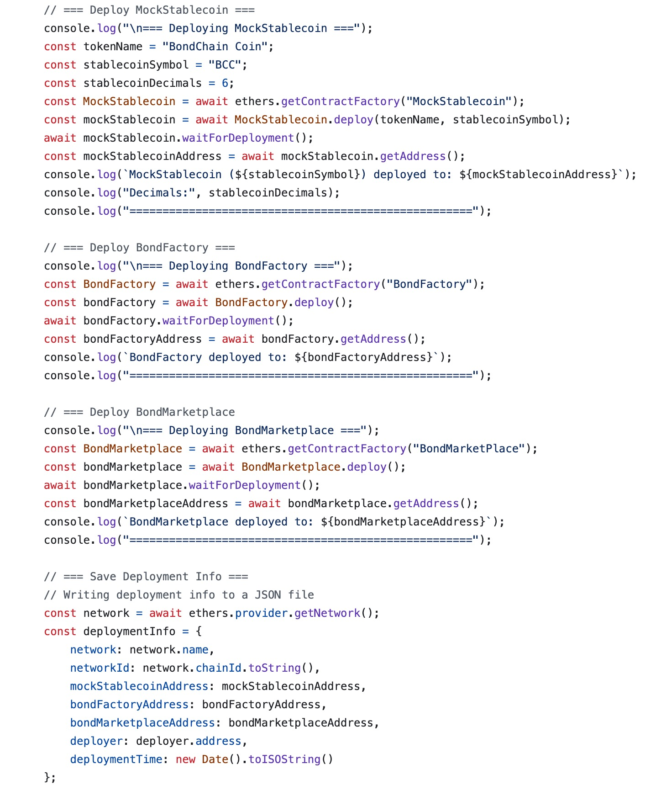

```mermaid
flowchart LR
    subgraph Platform["<font size=6>User Journey</font>"]
        direction LR
        subgraph "System Deployment"
            D1[Admin] -->|Deploys| D2["Core Contracts
            1. MockStableCoin
            2. BondFactory
            3. BondMarketplace"]
            D2 -->|Creates| D3["Bond Instance
            • Set Parameters
            • Fund Contract"]
            D3 <-->|Lists/Updates| D4[Initial and Continuous Offerings]
        end

        subgraph "Investment"
            A[Investor] -->|Browses| B[Bond Marketplace]
            B -->|Reviews| C["Bond Details
            • Price
            • Coupon Rate
            • Maturity Date"]
            C -->|Approves| E["Stablecoin Spend
            to TokenizedBond"]
            E -->|Executes| F[Purchase via
            Marketplace]
        end

        subgraph "Holding Period"
            F -->|Holds| G[Position]
            G -->|Regular| H[Claim Coupons]
            G -->|Optional| I[Secondary Market]
            
            I -->|Trade| J["P2P Exchange
            1. Approve Tokens
            2. Set Price
            3. Execute"]
            
            I -->|Gift| K["Gift Transfer
            1. Approve Tokens
            2. Execute"]
        end

        subgraph "Maturity"
            H & J & K -->|Until| N[Bond Matures]
            N -->|Redeem| P[Final Payment]
        end
    end

    D4 --> B

    style A fill:#f9f,stroke:#333,stroke-width:2px
    style D1 fill:#f9f,stroke:#333,stroke-width:2px
    style N fill:#bbf,stroke:#333,stroke-width:2px
    style P fill:#bfb,stroke:#333,stroke-width:2px
    
    classDef optional fill:#f96,stroke:#333,stroke-width:1px
    class I,J,K optional
    classDef deployment fill:#e6fff2,stroke:#333,stroke-width:1px
    class D1,D2,D3,D4 deployment

    %% Remove coloring from Platform wrapper
    style Platform fill:none
```

---
# You can also start simply with 'default'
theme: default
# random image from a curated Unsplash collection by Anthony
# like them? see https://unsplash.com/collections/94734566/slidev
background: https://images.unsplash.com/photo-1639322537231-2f206e06af84?fm=jpg&q=60&w=3000&ixlib=rb-4.0.3&ixid=M3wxMjA3fDB8MHxzZWFyY2h8MTV8fGJsb2NrY2hhaW58ZW58MHx8MHx8fDA%3D
# some information about your slides (markdown enabled)
title: Fractional Bond Trading Sharing
info: |
  ## Slidev Starter Template
  Presentation slides for developers.

  Learn more at [Sli.dev](https://sli.dev)
# apply unocss classes to the current slide
class: text-center
# https://sli.dev/features/drawing
drawings:
  persist: false
# slide transition: https://sli.dev/guide/animations.html#slide-transitions
transition: slide-left
# enable MDC Syntax: https://sli.dev/features/mdc
hideInToc: true 
mdc: true
# open graph
# seoMeta:
#  ogImage: https://cover.sli.dev
---

# BondChain

## A Blockchain-Based Platform for Fractional Bond Trading

  
    Press Space for next page <carbon:arrow-right class="inline"/>
  

  <button @click="$slidev.nav.openInEditor()" title="Open in Editor" class="text-xl slidev-icon-btn opacity-50 !border-none !hover:text-white">
    <carbon:edit />
  </button>
  <a href="https://github.com/slidevjs/slidev" target="_blank" alt="GitHub" title="Open in GitHub"
    class="text-xl slidev-icon-btn opacity-50 !border-none !hover:text-white">
    <carbon-logo-github />
  </a>

 

---
layout: default
hideInToc: true
transition: fade-out
---

# Table of contents

<Toc maxDepth="1"></Toc>

---
transition: fade-out
---

# Motivation

There are long standing barriers for retail investors to enter the bond market

- 💰 High minimum investment
- 🏢 Fragmented Secondary Market and Low Liquidity
- ⏱️ Complex Intermediation and Prolonged Settlement Times
- 🔍 Opaque Processes and Elevated Counterparty Risks

 
 

How about we make the bond divisible using Blockchain technology ? [OCBC's use case](https://www.ocbc.com/group/media/release/2025/ocbc-is-first-bank-in-singapore-to-avail-bespoke-tokenised-bonds-via-asset-tokenisation-platform)

<!--
You can have `style` tag in markdown to override the style for the current page.
Learn more: https://sli.dev/features/slide-scope-style
-->

<!--
Here is another comment.
-->

---
transition: slide-up
---

# Addressing the Inefficiencies
using a two-fold approach

  

    <!-- Left content -->
    <u>Tokenization & Fractional Ownership</u>
     
     
    

    Converts bond into digital tokens that can be fractionally owned, significantly lowering capital barrier
    

  

  

    <!-- Right content -->
    <u>Automated & Semi-Decentralised Trading</u>
     
     
    

    Reduces reliance on intermediaries, delivering near-instant transaction settlement
    

  

  

---
transition: fade-out
---

# Architecture & User Journey

  <!-- Top half with system architecture -->
  

  
 <!-- Bottom half with workflow --> 

 

 

---
transition: fade-in
---

# Smart Contracts Overview

  <!-- Top half with contract descriptions -->
  

  - `TokenizedBond`: Core asset representation of fractional ownership
  - `BondFactory`: Contract that manages the lifecycle of TokenizedBond instances
  - `BondMarketPlace`: Contract that acts as the unified interface and central hub for users to interact with bond offerings
  - `MockStableCoin`: Contract that simulates a designated payment and settlement currency in a test environment
  

   
   
  <!-- Bottom half with class diagram -->
  

 
 

---
transition: fade-in
---

# Sample Transactions & Logs
Most of the records are valid and immutable on Sepolia

  <!-- Left section with animation -->
  

    <h3 
      class="text-blue-500 mb-2"
      v-motion
      :initial="{ opacity: 0 }"
      :enter="{ opacity: 1, transition: { delay: 600, duration: 300 } }"
    >
      Purchase Transaction
    </h3>
    
  

  <!-- Right section with animation -->
  

    <h3 
      class="text-blue-500 mb-2"
      v-motion
      :initial="{ opacity: 0 }"
      :enter="{ opacity: 1, transition: { delay: 800, duration: 300 } }"
    >
      Coupon Claim Event
    </h3>
    
  

---
transition: slide-down
---

# Frontend

  <!-- Left column - text content -->
  

    <h3 class="text-blue-500 mb-4">Onboarding & Unified Dashboard</h3>
      

        🚀 Benefits are clearly communicated on the landing page
         
         
        📝 User-friendly form to create an account with ease
         
         
        🔑 Flexible sign-in and authentication options
         
         
        📊 Unified dashboard: View balances, manage bonds
    

    

    
  

  

  <!-- Right column - image -->

  <!-- Top image -->
  

    
  

    
  

  
  <!-- Bottom image -->

---
transition: fade-out
hideInToc: true 
---

# Frontend (2)

  <!-- Top half - text content -->
  

    <h3 class="text-blue-500 mb-4">Bond Marketplace Features</h3>
    📊 Latest bond listings: Status, price, and issuer info
     
     
    🔍 Searchable interface: Easy navigation by bond index
     
     
    📝 "View Details" drill down
  

  <!-- Bottom half - image -->
  

    
  

---
transition: slide-up
hideInToc: true 
---

# Frontend (3)

  <!-- Left half - Primary Market -->
  

    <h3 
      class="text-blue-500 mb-3"
      v-motion
      :initial="{ opacity: 0, y: -20 }"
      :enter="{ opacity: 1, y: 0, transition: { duration: 800 } }"
    >
      Primary Market Actions
    </h3>
    
  

  <!-- Right half - Secondary Market -->
  

    <h3 
      class="text-green-500 mb-3"
      v-motion
      :initial="{ opacity: 0, y: -20 }"
      :enter="{ opacity: 1, y: 0, transition: { delay: 200, duration: 800 } }"
    >
    </h3>
    
  

---
transition: slide-up
hideInToc: true 
---

# Frontend (4)

  <!-- Left half - Bond Purchase -->
  

    <h3 
      class="text-blue-500 mb-3"
      v-motion
      :initial="{ opacity: 0, y: -20 }"
      :enter="{ opacity: 1, y: 0, transition: { duration: 800 } }"
    >
      Secondary Market Actions (P2P)
    </h3>
        

        🤝 Peer-to-peer trading without intermediaries
         
         
        💰 Set your own price and trade quantity
         
         
        ⚡ Near-instant settlement on the blockchain
         
         
        🔒 Secure transactions with full transparency
        

  

  <!-- Right half - Bond Management -->
  

    
  

---
transition: fade-in
---

# Sepolia Deployment
Code snippet and actual contract addresses

  <!-- Left side - image -->
  

    
  

  <!-- Right side - text content -->
  

  <h3 class="text-blue-500 mb-4">Live on Ethereum Testnet</h3>

  <ul class="list-disc list-inside mb-4 ml-1">
    <li>
      BondFactory:
      <a href="https://sepolia.etherscan.io/address/0x8f0CEd3a1a468d9A4968879F918Bcfb18DA8dc24" target="_blank" rel="noopener noreferrer" class="text-green-600 hover:text-green-400 underline">
        <code>0x8f0...c24</code>
      </a>
    </li>
     
     
    <li>
      BondMarketplace:
      <a href="https://sepolia.etherscan.io/address/0xF66B3B3F6DdD8260B47eE1b00e7ab0e81965Bfd7" target="_blank" rel="noopener noreferrer" class="text-green-600 hover:text-green-400 underline">
        <code>0xF66...fd7</code>
      </a>
    </li>
     
     
    <li>
      MockStableCoin:
      <a href="https://sepolia.etherscan.io/address/0x9A1ac536dCFa4ddf7a219AcF70F9CFd25660eFFf
Decimals
" target="_blank" rel="noopener noreferrer" class="text-green-600 hover:text-green-400 underline">
        <code>0x9A1a...FFf</code>
      </a>
    </li>
     
     
    <li>
      Sample bond address:
      <a href="https://sepolia.etherscan.io/address/0x853EbE377ce1820e834412b96F0c4C4B230df4A6" target="_blank" rel="noopener noreferrer" class="text-green-600 hover:text-green-400 underline">
        <code>0x853...4A6</code>
      </a>
    </li>
  </ul>

 

---
transition: fade-in
---
# Challenges & Future Work

  <!-- Left half - Challenges -->

  <h3 
    class="text-red-500 mb-4"
    v-motion
    :initial="{ opacity: 0, y: -20 }"
    :enter="{ opacity: 1, y: 0, transition: { delay: 200, duration: 500 } }"
  >
    Conceptual and Technical Challenges
  </h3>
  
  

  <!-- Item 1 -->
  

    

      <carbon:warning class="text-sm" />
    

    

      Limited domain knowledge on Blockchain applications in general
      
 
        - Ended up becoming a showcase of coding instead of building actual useful and realistic product
      

    

  

  <!-- Item 2 -->
  

    

      <carbon:warning class="text-sm" />
    

    

      Limited experience with smart contracts and frontend development 
      
 
        - Impacting choices around design patterns and gas cost implications
      

    

  

  

  
<!-- Right half - Future Work -->

  <h3
    class="text-blue-500 mb-4"
    v-motion
    :initial="{ opacity: 0, y: -20 }"
    :enter="{ opacity: 1, y: 0, transition: { delay: 600, duration: 500 } }"
  >
    Future Roadmap
  </h3>

  <!-- This goes inside the right-hand column's div -->
  

    

      

        <carbon:rocket class="text-sm" />
      

      

        Fetching of realistic pricing data
        

          - Current model violates real world market dynamics
        

      

    

    

      

         <carbon:tool-kit class="text-sm" />
      

      

        Depositing function in exchange for equivalent value of stablecoins
        

          - Current implementations did not consider asset conversion mechanics
        

      

    

    

      

         <carbon:test-tool class="text-sm" />
      

      

        Potential rebalancing API
        

          - Compute and recommend optimal bond portfolio compositions based on diverse investment objectives
        

      

    

    

      

         <carbon:development class="text-sm" />
      

      

        Adopt a more TDD driven approach
        

          - Improve code quality and enable safer refactoring through more thorough testing
        

      

    

  
 

---
transition: fade-in
---

# Learning Outcomes

  

    
 
      

        <carbon:idea class="text-lg" />
      

      
 
        
Importance of adopting a user-centric design

        

          - Clarify contract interactions, required parameters, and potential state conflicts before extensive coding
        

      

    

    
 
      

        <carbon:chip class="text-lg" /> 
      

      

        
Better understanding of ERC-20 standard

        

          - Allowance, Approval, Ownership related properties
        

      

    

     
 
    

      <carbon:connect class="text-lg" />
    

    
 
      
Eliminating development silos

      

        - Frontend and smart contract developers need consistent communication
      

      

        - Early alignment on interfaces avoids incompatible implementations
      

      

        - Shared understanding of state transitions prevents integration issues
      

    

  

  
 
  

    <carbon:blockchain class="text-lg" />
  

  
 
    
Blockchain-specific programming mindset

    

      - Considering state management carefully as all changes are permanent
    

    

      - Optimizing for gas costs to ensure economic viability of transactions
    

    

      - Planning for immutability and designing upgrade patterns when needed
    

  

  

---
transition: slide-up
class: text-center pt-10
---

# Demo

  

    
Smart Contracts

    <a 
      href="https://sepolia.etherscan.io/address/0x8f0CEd3a1a468d9A4968879F918Bcfb18DA8dc24"
      target="_blank" 
      class="px-5 py-3 bg-blue-50 hover:bg-blue-100 text-blue-700 rounded-lg transition-colors flex items-center border border-blue-200"
    >
      <carbon:code class="mr-2" /> View on Etherscan
    </a>
  

  
  

    
Source Code

    <a 
      href="https://github.com/whanyu1212/fractional-bond-trading" 
      target="_blank" 
      class="px-5 py-3 bg-blue-50 hover:bg-blue-100 text-blue-700 rounded-lg transition-colors flex items-center border border-blue-200"
    >
      <carbon-logo-github class="mr-2" /> View Repository
    </a>
  

  

    <carbon:information class="mr-2" />
    This project is a prototype for demonstration purposes
  

<PoweredBySlidev mt-10 />
